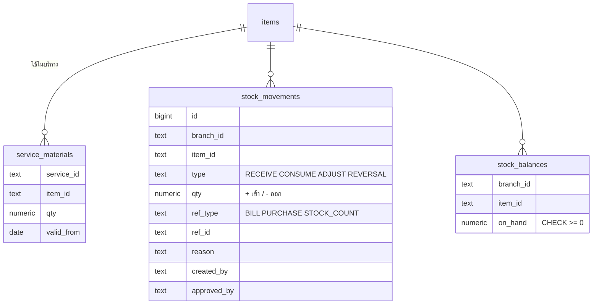
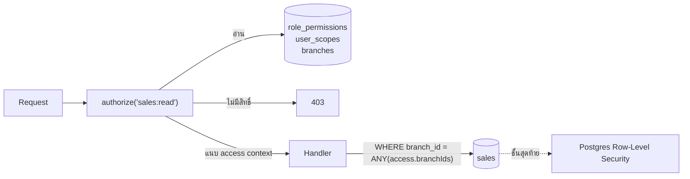
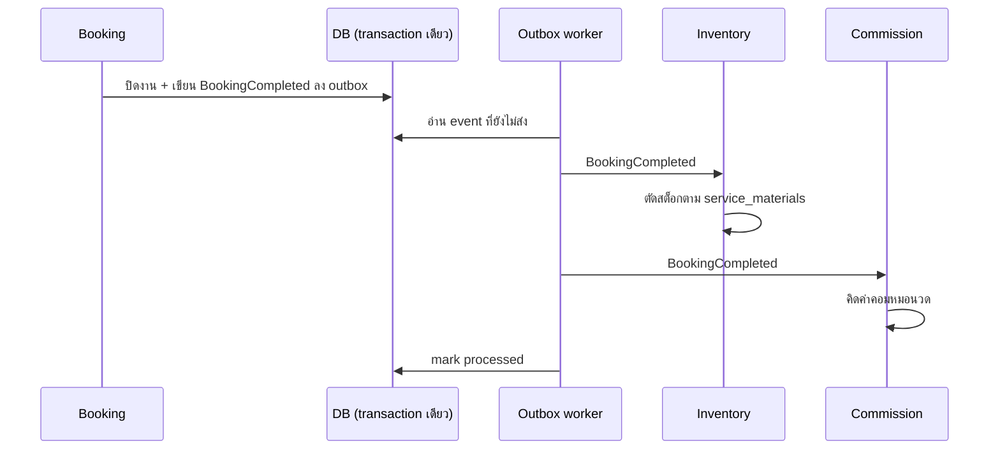
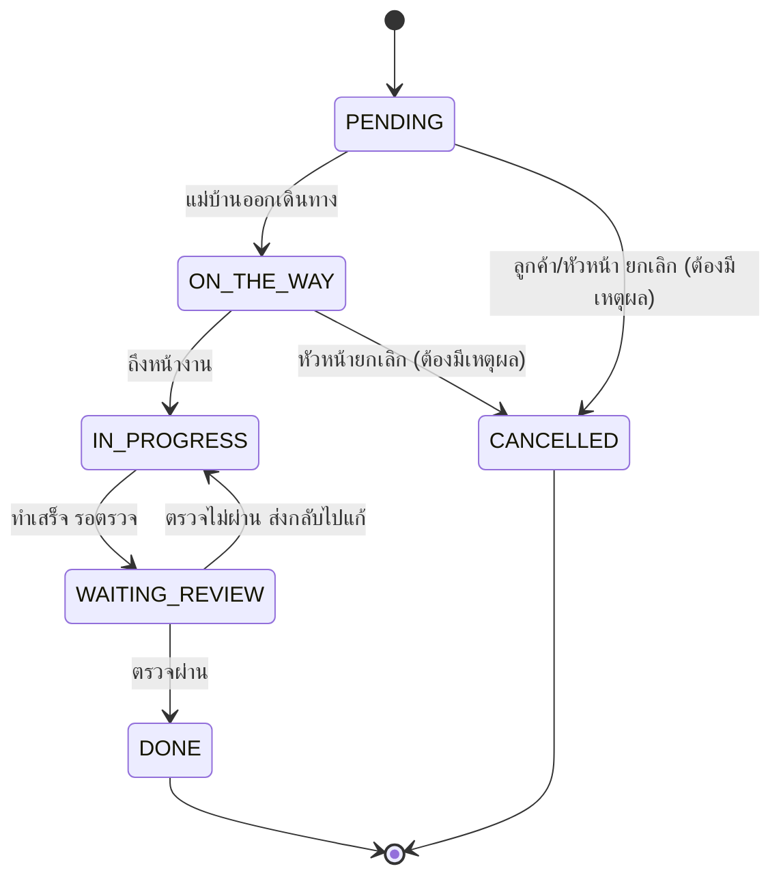
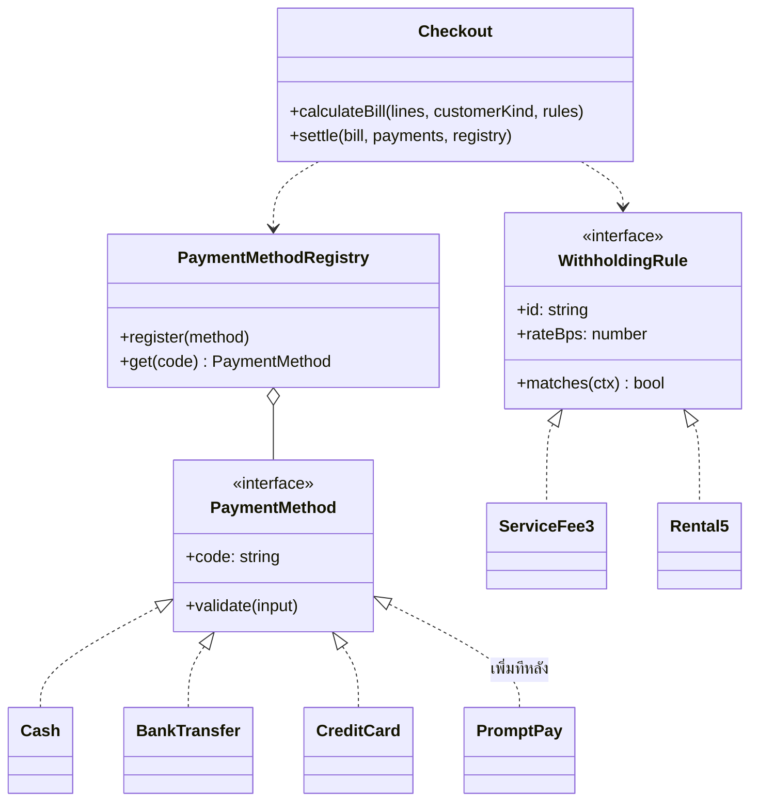
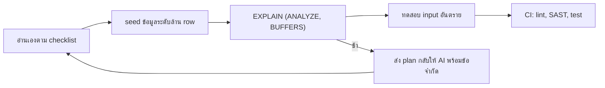
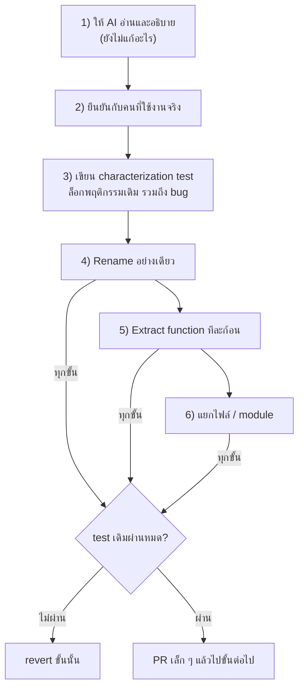

# แบบทดสอบ Software Developer – ธีรเมธ ภู่ทอง

ผมตอบทั้ง 9 ข้อโดยมองเป็นระบบหลังบ้านร้านสปาระบบเดียว คำตอบแต่ละข้อจึงต่อกัน เช่น จองเสร็จในข้อ 3 จะไปตัดสต็อกตามข้อ 1 และ test ในข้อ 8 ก็ test โค้ดของข้อ 5

ส่วนที่เขียนเป็นโค้ดได้ ผมทำไว้ใน repo นี้และ test ผ่านทั้งหมด จะได้เห็นว่าสิ่งที่ตอบใช้งานได้จริง

```bash
npm install
npm run check   # typecheck + เช็ก module boundary + test ทั้งหมด
```

| ข้อ | เรื่อง | โค้ดที่เกี่ยวข้อง |
|---|---|---|
| 1 | ตัดสต็อกอัตโนมัติ | [`db/schema.sql`](db/schema.sql), [`modules/inventory`](src/modules/inventory) |
| 2 | สิทธิ์ข้ามสาขา | [`modules/access`](src/modules/access), RLS ใน `db/schema.sql` |
| 3 | Modular Monolith | [`src/app.ts`](src/app.ts), [`shared/events.ts`](src/shared/events.ts), [`scripts/check-module-boundaries.ts`](scripts/check-module-boundaries.ts) |
| 4 | State machine งานแม่บ้าน | [`modules/housekeeping`](src/modules/housekeeping) |
| 5 | การจ่ายเงินและหัก ณ ที่จ่าย | [`modules/billing`](src/modules/billing) |
| 6 | Review โค้ดจาก AI | อธิบายด้านล่าง |
| 7 | Data privacy กับ LLM | [`tools/mask-for-llm.ts`](tools/mask-for-llm.ts) |
| 8 | Unit test ของข้อ 5 | [`billing/checkout.test.ts`](src/modules/billing/checkout.test.ts) |
| 9 | Refactor legacy code | อธิบายด้านล่าง |

ไฟล์ [`CLAUDE.md`](CLAUDE.md) คือกติกาที่ผมให้ AI อ่านก่อนเริ่มงานใน repo นี้ทุกครั้ง

---

## ข้อ 1: ตัดสต็อกเมื่อปิดบิล

ถ้าบรีฟสั้นๆ ว่า "ออกแบบตารางตัดสต็อก" AI มักจะให้ตาราง `stock` ที่มีคอลัมน์ `qty` แล้วตอนปิดบิลก็ `UPDATE stock SET qty = qty - 1` ใช้งานได้ แต่พอยอดไม่ตรงจะไม่มีทางรู้ว่าหายไปตอนไหน

ผมเลยออกแบบให้สต็อกเป็นสมุดบัญชี (ledger) ทุกการเปลี่ยนแปลงเป็น 1 row ใน `stock_movements` ซึ่งเพิ่มได้อย่างเดียว ห้ามแก้ห้ามลบ (มี trigger กันไว้) ส่วนยอดคงเหลือเก็บแยกใน `stock_balances` เพื่อให้อ่านเร็ว



เรื่องที่โจทย์ถาม ผมจัดการแบบนี้

- **ปรับยอดมือ** เป็น movement ประเภท `ADJUST` ซึ่ง DB บังคับให้มี `reason` และ `approved_by` ทุกครั้ง
- **ยกเลิกบิล** ไม่ลบ movement เดิม แต่สร้าง `REVERSAL` กลับทิศ ประวัติจึงครบเสมอ
- **ตรวจสอบย้อนหลัง** ดูจาก ledger ได้ว่าใครทำอะไรเมื่อไหร่ และมี view `stock_drift` ไว้รันทุกคืนเพื่อเช็กว่ายอดใน balances ตรงกับผลรวม ledger
- **สต็อกติดลบ** กัน 2 ชั้น ชั้นแรกตอนตัดใช้ `UPDATE ... WHERE on_hand >= $qty` ถ้าได้ 0 row แปลว่าของไม่พอ ให้ rollback ทั้งบิล คำสั่งนี้ lock row ไว้ระหว่างทำงาน สองบิลที่ปิดพร้อมกันจึงตัดเกินไม่ได้ ชั้นที่สองคือ `CHECK (on_hand >= 0)` เป็นด่านสุดท้าย ต่อให้ application มี bug
- **ปิดบิลซ้ำ** (กดสองครั้ง หรือระบบ retry) ใช้ `UNIQUE (ref_type, ref_id, item_id, type)` บิลเดิมจึงตัดของชิ้นเดิมได้ครั้งเดียว

วิธีบรีฟ AI ของผมคือใส่ข้อบังคับทางธุรกิจให้ครบ และให้มันอธิบายแนวทางก่อนเขียนโค้ด

```text
ช่วยออกแบบ schema PostgreSQL สำหรับตัดสต็อกวัสดุอัตโนมัติเมื่อปิดบิลบริการ
บริบท: ร้านสปาหลายสาขา บริการหนึ่งใช้วัสดุหลายอย่าง เช่น นวดน้ำมัน 90 นาที = น้ำมัน 30ml + ผ้าขนหนู 2 ผืน

ข้อบังคับ
- ยอดสต็อกต้องย้อนดูได้ว่าเปลี่ยนเพราะอะไร ใครทำ เมื่อไหร่ ห้าม UPDATE ยอดโดยไม่มีประวัติ
- ต้องปรับยอดมือได้ (นับสต็อกไม่ตรง ของเสีย) โดยมีเหตุผลและคนอนุมัติ
- ยกเลิกบิลต้องคืนสต็อกได้ โดยไม่ลบประวัติเดิม
- สต็อกห้ามติดลบ แม้สองบิลปิดพร้อมกัน ต้องกันที่ DB ไม่ใช่แค่ใน application
- ระบบ retry ปิดบิลเดิมซ้ำ ต้องไม่ตัดซ้ำ

ยังไม่ต้องเขียน DDL ขอแนวทางก่อนว่า
1. จะเก็บยอดคงเหลือแบบไหน และทำไม
2. จะกันสต็อกติดลบตอน concurrent อย่างไร
3. design นี้ยังพลาดได้ในกรณีไหน
```

พอตกลงแนวทางกันได้แล้วค่อยให้เขียน DDL แล้วผมเช็กเองว่ามี constraint ครบตามข้อบังคับทุกข้อ ถ้าให้ AI เขียนรวดเดียวตั้งแต่แรก มักได้ตารางที่ดูครบแต่เช็กสต็อกใน application แล้วค่อย update ซึ่งเกิด race condition ได้

## ข้อ 2: สิทธิ์ข้ามสาขา

หลักคือไม่เขียนเงื่อนไขอย่าง `if (role === 'area_manager')` ไว้ในโค้ด แต่แยกสิทธิ์เป็น 2 คำถามและเก็บทั้งคู่เป็นข้อมูลใน DB

1. **ทำอะไรได้บ้าง** เป็น permission ที่ผูกกับ role (`role_permissions`) เช่น `sales:read`, `customer:read_contact`
2. **เห็นข้อมูลของที่ไหน** เป็น scope ที่ผูกกับ user (`user_scopes`) มี 3 ระดับคือ สาขา, เขต และทั้งบริษัท



middleware ทำงานครั้งเดียวต่อ request คำนวณว่า user นี้เห็นสาขาไหนบ้าง แล้วแนบไปกับ request handler แค่เอา `access.branchIds` ไปต่อใน query และเรียก `access.can('customer:read_contact')` ก่อนแสดงเบอร์โทร ไม่ต้องรู้ว่า user เป็นตำแหน่งอะไร

ผมเปิด Row-Level Security ของ Postgres ไว้อีกชั้น เผื่อมีคนเขียน query ใหม่แล้วลืมใส่ WHERE ข้อมูลข้ามสาขาก็ยังไม่หลุด

เมื่อธุรกิจเปลี่ยน
- **เปิดสาขาใหม่** เพิ่ม row ใน `branches` แล้ว Area Manager ของเขตนั้นเห็นทันที
- **ตำแหน่งใหม่** เช่น Auditor ที่ดูยอดได้ทุกสาขาแต่ export ไม่ได้ ก็เพิ่ม row ใน `role_permissions` กับ `user_scopes` ไม่ต้อง deploy โค้ด

ทั้งสองกรณีมี test อยู่ใน [`policy.test.ts`](src/modules/access/policy.test.ts)

ตอนให้ AI ช่วยเขียน ผมจะให้ตัวอย่างคนจริงๆ หลายแบบ แล้วให้มันเขียน test จากตัวอย่างก่อนค่อยเขียน middleware

```text
เขียน authorization middleware (TypeScript) สำหรับระบบหลายสาขา
ห้าม hardcode ชื่อ role ในโค้ด ทั้ง permission และขอบเขตสาขาต้องมาจากข้อมูล (ตาราง role_permissions, user_scopes)

ตัวอย่างที่ต้องได้ผลตามนี้
- พนักงานสาขา A: ดูยอดสาขา A ได้, ดูสาขา B ไม่ได้, ไม่เห็นเบอร์โทรลูกค้า
- Area Manager เขตตะวันออก: เห็นสาขา A และ B, ไม่เห็นสาขา C ที่อยู่เขตอื่น
- เพิ่มสาขา D ในเขตตะวันออก: Area Manager ต้องเห็นโดยไม่แก้โค้ด
- เพิ่มตำแหน่ง Auditor: เห็นทุกสาขาแต่ export ไม่ได้ โดยไม่แก้โค้ด

ให้เขียน test จากตัวอย่างข้างบนก่อน แล้วค่อยเขียน middleware ให้ test ผ่าน
```

## ข้อ 3: Modular Monolith (Booking / Inventory / Commission)

```text
src/
├── shared/
│   ├── events.ts        # event ที่ใช้คุยข้าม module ทั้งหมด
│   ├── customer.ts      # CustomerReader: ข้อมูลลูกค้าที่ทุก module อ่านได้
│   └── money.ts
├── modules/
│   ├── booking/
│   │   └── index.ts     # public API (module อื่น import ได้แค่ไฟล์นี้)
│   ├── inventory/
│   │   ├── index.ts
│   │   └── stock-ledger.ts
│   └── commission/
│       └── index.ts
└── app.ts               # จุดเดียวที่ประกอบทุก module เข้าด้วยกัน
```

กติกามี 3 ข้อ

1. **module ห้าม import ไส้ในกัน** เรียกได้ผ่าน `index.ts` เท่านั้น ผมเขียน [script](scripts/check-module-boundaries.ts) เช็กเรื่องนี้ไว้ให้รันใน CI ทุก PR เพราะ AI ชอบ import ทางลัดตรงไปที่ไฟล์ข้างในเวลามันหาของเจอ
2. **ข้อมูลลูกค้าเป็นของกลาง** (shared kernel) ทุก module อ่านผ่าน `CustomerReader` ได้ แต่แก้ได้ที่เดียว
3. **module คุยกันด้วย event** booking ไม่รู้จัก inventory หรือ commission เลย มันแค่ประกาศว่า `BookingCompleted` ใครอยากทำอะไรต่อก็ไป subscribe เอง



โจทย์บอกว่า "ทันที" ผมเลยใช้ outbox แทนการเรียก function ต่อกันตรงๆ ถ้าส่วนตัดสต็อกพัง การจองต้องไม่หายและต้อง retry ได้ ซึ่ง handler ทั้งสองฝั่งต้องทนการถูกเรียกซ้ำได้ (inventory กันด้วย UNIQUE ใน ledger ส่วน commission เช็ก billId ซ้ำ) ผู้ใช้ไม่รู้สึกว่าช้า เพราะ worker ทำงานภายในไม่กี่วินาที

ใน demo นี้ event bus ทำงานใน process เดียวเพื่อให้ test ง่าย ([`app.test.ts`](src/app.test.ts) ลองจองแล้วเช็กว่าสต็อกถูกตัดและค่าคอมถูกคิด)

ตอนบรีฟ AI ผมไม่ให้มันออกแบบทั้งระบบในรอบเดียว แต่แบ่งเป็นรอบๆ

```text
รอบ 1: ขอแค่ folder structure และ public API (index.ts) ของ booking, inventory, commission
      ข้อห้าม: module ห้าม import ไฟล์ข้างในของกันและกัน ห้ามเรียก service ข้าม module
      ต้องมี: ข้อมูลลูกค้าใช้ร่วมกันผ่าน interface เดียว
      ส่งเป็น tree + class diagram (mermaid) ยังไม่ต้องเขียน implementation

รอบ 2: เมื่อจองสำเร็จ ต้องตัดสต็อกและคิดค่าคอม ออกแบบการสื่อสารด้วย event
      บอกด้วยว่าถ้า inventory พังระหว่างทาง ข้อมูลจะเป็นยังไง และ retry อย่างไรไม่ให้ตัดซ้ำ

รอบ 3: implement ทีละ module พร้อม test
```

พอกติกาลงตัวแล้ว ผมเขียนไว้ใน `CLAUDE.md` งานรอบต่อๆ ไปจะได้ไม่ต้องบรีฟซ้ำ

## ข้อ 4: สถานะงานแม่บ้าน

กฎทั้งหมดว่าสถานะไหนไปไหนได้และใครเป็นคนเปลี่ยน อยู่ในตาราง `TRANSITIONS` ที่เดียว ([`task-status.ts`](src/modules/housekeeping/task-status.ts)) โค้ดส่วนอื่นห้ามเช็ก status เอง ต้องเรียก `transition()` หรือ `canTransition()` เท่านั้น if-else จึงไม่กระจายไปทั่วโปรเจกต์



ทุกครั้งที่เปลี่ยนสถานะ จะบันทึกลง `housekeeping_task_status_history` ว่าใครเปลี่ยนจากอะไรเป็นอะไร พร้อมเหตุผล เวลาลูกค้าร้องเรียนจะย้อนดูได้

ส่วนที่ผมว่าได้ประโยชน์จาก AI มากที่สุดคือ test ผมให้ AI สร้าง test จากตารางเดียวกันแบบอัตโนมัติ คือทุกคู่สถานะที่ไม่ได้อยู่ในตารางต้องถูกปฏิเสธ (ตอนนี้มี 29 คู่) ต่อไปถ้าเพิ่มสถานะใหม่ test ชุดนี้ก็ครอบคลุมให้เองโดยไม่ต้องเขียนเพิ่ม

```text
นี่คือ flow สถานะงาน: <วาง mermaid diagram ด้านบน>
1. เขียน transition table เป็นข้อมูล (สถานะต้นทาง -> ปลายทาง, role ที่ทำได้, ต้องมีเหตุผลไหม)
2. เขียน transition() ที่อ่านจากตารางนี้อย่างเดียว ห้ามมี if-else ตามชื่อสถานะ
3. เขียน test ที่ loop ทุกคู่สถานะ คู่ที่ไม่อยู่ในตารางต้อง throw
4. ถ้าเห็นว่า flow นี้มีช่องโหว่ทางธุรกิจ (เช่น งานค้างที่ ON_THE_WAY ตลอดไป) ให้ถามมา อย่าเติมเอง
```

ข้อ 4 ของ prompt ผมใส่ไว้เพราะ AI ชอบเติม transition ที่ดูสมเหตุสมผลเอง เช่น ให้แม่บ้านยกเลิกงานได้ ซึ่งอาจผิดนโยบายบริษัท

## ข้อ 5: การจ่ายเงินและภาษีหัก ณ ที่จ่าย

แยกสิ่งที่เปลี่ยนบ่อยออกเป็น interface 2 ตัว checkout ไม่ต้องรู้ว่ามีวิธีจ่ายหรือกฎภาษีอะไรบ้าง



```text
src/modules/billing/
├── index.ts
├── checkout.ts               # คิดยอด VAT ภาษีหัก ณ ที่จ่าย และตรวจยอดชำระ
├── payment-method.ts         # interface PaymentMethod + Registry
├── payment-methods/
│   └── index.ts              # Cash, Transfer, Card (เพิ่มวิธีใหม่ = เพิ่มไฟล์ + register 1 บรรทัด)
└── withholding/
    └── rules.ts              # กฎ 3%, 5% (เพิ่มกฎใหม่ = เพิ่ม object ในลิสต์)
```

เพิ่มวิธีจ่ายใหม่อย่าง PromptPay หรือกฎภาษีใหม่ ทำได้โดยไม่ต้องแตะ `checkout.ts` เลย ใน test มีกรณีนี้ให้ดูด้วย

รายละเอียดที่ผมใส่ใจ
- เงินทั้งหมดเก็บเป็นสตางค์ (integer) ไม่ใช้ float
- ภาษีหัก ณ ที่จ่ายคิดจาก **ยอดก่อน VAT**
- หักเฉพาะลูกค้านิติบุคคล และยอดตั้งแต่ 1,000 บาทขึ้นไป
- ถ้าบิลเดียวเข้าได้กับกฎ 2 ข้อพร้อมกัน ระบบจะ error ไม่เลือกให้เอง เพราะการเลือกผิดทำให้ออกใบ 50 ทวิผิด

กติกาภาษีพวกนี้ผมเขียนตามที่เข้าใจ ก่อนใช้จริงควรให้ทีมบัญชียืนยันอีกครั้ง และ AI ก็ต้องถามด้วยเหมือนกัน ผมใส่ไว้ใน `CLAUDE.md` ว่าถ้าไม่แน่ใจ business rule ให้ถาม ห้ามเดา

```text
ออกแบบ module billing ให้เพิ่มวิธีชำระเงินและกฎภาษีหัก ณ ที่จ่ายใหม่ได้โดยไม่แก้ checkout (Open-Closed)
ข้อมูลที่ต้องรู้
- เงินเป็นสตางค์ integer, เปอร์เซ็นต์เป็น basis point
- VAT 7% คิดจากยอดรวมทั้งบิล
- หัก ณ ที่จ่าย 3% (บริการ) / 5% (ค่าเช่า) คิดจากยอดก่อน VAT เฉพาะลูกค้านิติบุคคล ยอดตั้งแต่ 1,000 บาท
- บิลเดียวจ่ายได้หลายช่องทาง ยอดรวมต้องตรงกับยอดสุทธิทุกสตางค์

ส่ง folder structure + interface ก่อน แล้วอธิบายว่าถ้าวันหน้ามี "QR PromptPay" และ "ส่วนลดภาษีโปรโมชัน" ต้องแก้ไฟล์ไหนบ้าง
ถ้าคำตอบคือต้องแก้ checkout.ts แปลว่า design ยังไม่ผ่าน
```

## ข้อ 6: โค้ดจาก AI ที่สวยแต่ช้าหรือไม่ปลอดภัย

ตัวอย่างที่เจอบ่อยมาก เขียนฟังก์ชันสรุปยอดรายเดือนแบบนี้แล้ว test ผ่าน เพราะข้อมูล test มีแค่ไม่กี่ row

```ts
// AI เขียนมา: ดูดี รันผ่าน
const rows = await db.query(`SELECT * FROM sales WHERE branch_id = '${branchId}'`);
const byMonth = rows.reduce((acc, r) => { /* group ใน JS */ }, {});
```

ปัญหา 3 อย่างในโค้ดไม่กี่บรรทัด
- ต่อ string เข้า SQL ตรงๆ โดน SQL injection ได้
- ดึงทุก row ทุกคอลัมน์มาไว้ใน memory
- group ใน JS ทั้งที่ DB ทำได้เร็วกว่ามาก

```sql
-- หลังแก้
SELECT date_trunc('month', created_at) AS month, sum(amount) AS total
FROM sales
WHERE branch_id = $1 AND created_at >= $2 AND created_at < $3
GROUP BY 1
ORDER BY 1;
-- index: CREATE INDEX ON sales (branch_id, created_at) INCLUDE (amount);
```

ขั้นตอนที่ผมใช้ตรวจโค้ดจาก AI



1. **อ่านเองก่อน** ตาม checklist ของผม คือ query ใน loop (N+1), `SELECT *`, ไม่มี LIMIT หรือช่วงเวลา, ต่อ string เข้า SQL และคำนวณในแอปทั้งที่ DB ทำได้
2. **ทดสอบกับข้อมูลขนาดจริง** ใช้ `generate_series` สร้างยอดขาย 1–5 ล้าน row แล้วดู `EXPLAIN (ANALYZE, BUFFERS)` ว่ามี Seq Scan บนตารางใหญ่ หรือ sort ที่ล้นลง disk ไหม
3. **ลองใส่ input อันตราย** เช่น `' OR 1=1 --` ในทุก parameter และให้ SAST (Semgrep, eslint-plugin-security) รันใน CI ทุก PR
4. **ไม่ merge ถ้าไม่มี test** ที่ครอบคลุมกรณีข้อมูลว่างและข้อมูลข้ามเดือน

ตอนส่งกลับไปให้ AI แก้ ผมไม่สั่งแค่ว่า "ช่วยทำให้เร็วขึ้น" แต่ส่งหลักฐานกลับไปด้วย

```text
ฟังก์ชัน getMonthlySales ด้านล่างใช้เวลา 14 วินาทีกับข้อมูล 1.2 ล้าน row
ผล EXPLAIN ANALYZE: <วาง plan>
schema และ index ที่มีอยู่: <วาง>

ข้อจำกัด: Postgres 16, ห้ามเปลี่ยน signature, ผลลัพธ์ต้องตรงกับเดิมทุกตัวเลข, query ต้อง parameterized

1. ชี้จาก plan ว่าคอขวดอยู่ตรงไหน
2. เสนอทางแก้ 2-3 ทาง (index / แก้ query / summary table) พร้อมข้อเสียของแต่ละทาง
ยังไม่ต้องเขียนโค้ด
```

การให้ AI เสนอหลายทางพร้อมข้อเสีย ทำให้เราเป็นคนตัดสินใจ ไม่ใช่รับทางแรกที่มันคิดออก

## ข้อ 7: Data privacy เวลาใช้ LLM

งานปัจจุบันของผมที่ Ooca เป็น telemedicine ข้อมูลเป็นข้อมูลสุขภาพ ซึ่งอ่อนไหวกว่ายอดขายอีก เรื่องนี้ผมจึงระวังเป็นพิเศษ หลักที่ใช้คือ **ส่งให้ AI เท่าที่จำเป็นต่อการแก้ปัญหา** ซึ่งส่วนใหญ่ไม่ต้องใช้ข้อมูลจริงเลย

| งาน | สิ่งที่ส่งให้ AI |
|---|---|
| เขียน query ซับซ้อน | schema (DDL) อย่างเดียว ถ้าต้องมีตัวอย่าง ใช้ข้อมูลปลอมที่หน้าตาเหมือนจริง |
| debug error log | log ที่ผ่าน [`mask-for-llm`](tools/mask-for-llm.ts) แล้ว |
| debug ข้อมูลผิด | ผล query ที่ mask แล้ว หรือ query จาก replica ที่ mask ไว้ตั้งแต่ต้น |

เครื่องมือ mask ที่ผมทำไว้ใน repo นี้ จะแทนอีเมล เบอร์โทร เลขบัตรประชาชน เลขบัตรเครดิต และชื่อ ด้วย token อย่าง `CUSTOMER_1` หรือ `PHONE_1`

```bash
cat error.log | npx tsx tools/mask-for-llm.ts > safe.log
```

```text
ก่อน:  payment failed for somchai@example.com tel 081-234-5678
หลัง:  payment failed for EMAIL_1 tel PHONE_1
```

ค่าเดิมได้ token เดิมทุกครั้ง AI จึงยังไล่ได้ว่า row ไหนเป็นลูกค้าคนเดียวกัน ซึ่งสำคัญมากตอน debug ส่วนตารางที่แปลง token กลับเป็นค่าจริงเก็บไว้ในเครื่องเท่านั้น (อยู่ใน `.gitignore`) เอาไว้แปลงคำตอบของ AI กลับ

ระดับทีม ผมว่าต้องมีกติกาเพิ่ม
- ใช้ AI ผ่านบัญชีองค์กรหรือ API ที่ไม่เอาข้อมูลไป train และมี retention ชัดเจน ห้ามใช้บัญชีส่วนตัวกับงานบริษัท
- AI agent ห้ามต่อ production DB ตรงๆ ให้ใช้ replica ที่ mask แล้ว
- มี pre-commit (เช่น gitleaks) กัน secret และไฟล์ dump หลุดเข้า repo

ทั้งหมดนี้คือหลัก data minimization ตาม PDPA คือใช้ข้อมูลส่วนบุคคลเท่าที่จำเป็นต่อวัตถุประสงค์

## ข้อ 8: บรีฟ AI ให้เขียน unit test ของข้อ 5

ถ้าสั่งแค่ว่า "เขียน unit test ให้หน่อย" AI จะเขียน happy path 3–4 อันแล้วจบ ผมเลยให้มันลิสต์ edge case ก่อน โดยบอกมุมที่ต้องคิดให้ แล้วผมคัดเองว่าจะเอาข้อไหน

```text
นี่คือ checkout.ts และ withholding/rules.ts: <วางโค้ด>

ยังไม่ต้องเขียน test ขอรายการ edge case ก่อน แยกตามหมวด
- ขอบของตัวเลข: ยอดพอดีเกณฑ์ ต่ำกว่าเกณฑ์ 1 สตางค์ ศูนย์ ติดลบ
- การปัดเศษ: ยอดที่คูณแล้วได้ทศนิยมเกิน 2 ตำแหน่ง
- ลำดับการคำนวณ: VAT กับหัก ณ ที่จ่าย อะไรคิดจากฐานไหน
- การผสม: หลายรายการ หลายประเภทบริการ หลายช่องทางจ่ายในบิลเดียว
- ข้อมูลผิด: วิธีจ่ายที่ไม่รู้จัก ข้อมูลอ้างอิงไม่ครบ กฎภาษีซ้อนกัน

แต่ละข้อบอกผลที่ "ควรเป็น" ตามธุรกิจ ไม่ใช่ตามที่โค้ดตอนนี้ทำ
ถ้าข้อไหนไม่แน่ใจว่าธุรกิจต้องการแบบไหน ให้ mark ว่า "ต้องถามบัญชี"
```

บรรทัด **"ผลที่ควรเป็นตามธุรกิจ ไม่ใช่ตามโค้ด"** สำคัญที่สุด ถ้าไม่บอก AI จะอ่านโค้ดแล้วเขียน test ให้ตรงกับโค้ด ต่อให้โค้ดผิด test ก็ผ่าน

Edge case ที่ผมเลือกมาเขียน test จริง ([`checkout.test.ts`](src/modules/billing/checkout.test.ts))

1. **ฐานภาษีต้องไม่รวม VAT** บริการ 1,000 + VAT 70 = 1,070 ต้องหัก 30.00 ไม่ใช่ 32.10 ยอดสุทธิคือ 1,040
2. **ขอบเกณฑ์ 1,000 บาท** ยอด 999.99 ไม่หัก แต่ 1,000.00 หัก ส่วนบิลที่แต่ละรายการต่ำกว่า 1,000 แต่ทั้งบิลเกิน ก็ยังต้องหัก
3. **ปัดเศษ** 3% ของ 1,033.33 = 30.9999 ต้องได้ 31.00 คิดเป็น integer ตลอด จึงไม่เจอปัญหาทศนิยมเพี้ยนแบบ float
4. **จ่ายหลายช่องทาง** เงินสด 40 + บัตร 1,000 = 1,040 ผ่าน แต่ถ้าขาดไป 1 สตางค์ต้องไม่ผ่าน
5. **นิติบุคคลจ่ายเต็มยอดโดยไม่หักภาษี** ต้องไม่ผ่าน ถ้าปล่อยไป ใบ 50 ทวิกับยอดเงินจะไม่ตรงกัน
6. **บิลผสม** บริการ 3% กับค่าเช่า 5% ในบิลเดียว ต้องแยกฐานคิด

## ข้อ 9: Refactor ไฟล์ 2,000 บรรทัดที่ไม่มีเอกสาร

หลักของผมคือ **ห้ามให้ AI แก้โค้ดจนกว่าจะมี test ที่จับพฤติกรรมเดิมไว้ได้** และทุกขั้นต้องเล็กพอที่ review ได้ใน PR เดียว



1. **ให้ AI อ่านก่อน ยังไม่แก้** ขอให้มันเขียนสรุปว่าแต่ละช่วงทำอะไร ตัวแปร `a`, `b`, `c` น่าจะหมายถึงอะไร และมีจุดไหนที่มันไม่แน่ใจ
2. **ยืนยันกับคนใช้งาน** เอาสรุปนั้นไปถามคนที่ใช้ระบบจริง เพราะ AI เดาความหมายจากโค้ดได้ แต่ไม่รู้ว่าธุรกิจตั้งใจแบบนั้นหรือเปล่า
3. **Characterization test** ให้ AI ช่วยสร้าง input หลายแบบ (เอามาจาก log จริงที่ mask แล้วยิ่งดี) รันกับโค้ดเดิม แล้วบันทึก output ไว้เป็น snapshot ถ้าโค้ดเดิมมี bug ก็ล็อกไว้ตามนั้นก่อน
4. **Rename อย่างเดียว** ให้ AI เสนอชื่อ แต่ใช้ฟีเจอร์ rename ของ IDE เป็นคนแก้ ไม่ให้ AI เขียนไฟล์ใหม่ทั้งไฟล์ เพราะตอนเขียนใหม่ AI มักแอบ "ปรับปรุง" logic ไปด้วย
5. **Extract function** ทีละก้อน และ test ต้องผ่านทุกครั้ง
6. **ค่อยแยกไฟล์หรือ module** ตอนนี้เข้าใจโค้ดพอแล้ว

prompt ตอน refactor ผมจะใส่ข้อห้ามชัดๆ

```text
refactor เฉพาะฟังก์ชัน calculateX (บรรทัด 340-420) ด้วยการ extract function เท่านั้น
ห้ามเปลี่ยน logic ห้ามเปลี่ยนลำดับการคำนวณ ห้ามลบเงื่อนไขที่ดูเหมือนไม่จำเป็น
ถ้าเจอจุดที่น่าจะเป็น bug ให้ใส่ comment // TODO(bug?): ... แล้วแจ้งผม ไม่ต้องแก้
ต้องผ่าน test ใน legacy.characterization.test.ts ทั้งหมดโดยไม่แก้ test
```

ข้อ "ห้ามแก้ bug ระหว่าง refactor" สำคัญ บางครั้ง bug ในระบบเก่ามีคนพึ่งพามันอยู่ เช่น รายงานที่ปัดเศษแบบแปลกๆ แต่ฝ่ายบัญชีใช้ตัวเลขนั้นมาตลอด ควรแยกเป็นงานแก้ bug อีก PR ที่มีคนเซ็นรับรู้ ไม่ปนกับ refactor
